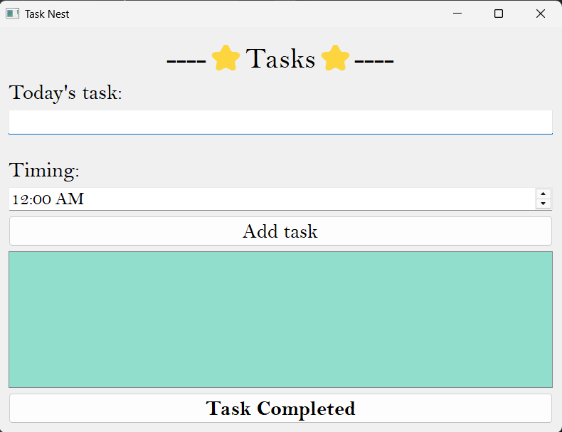

# ⭐ Task Nest

A simple To-Do List desktop application made using Python and PyQt5.

##Preview


## Features
- Add tasks
- Set a time for each task
- View tasks in a list
- Mark tasks as completed
- Remove completed tasks

## Technologies Used
- Python
- PyQt5

## How to Run
Install PyQt5:

```bash
pip install PyQt5
python todolist.py